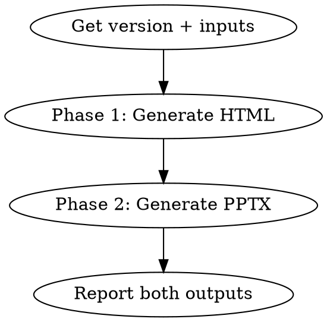

# Create Full Release Notes (HTML + PPTX)

Generate comprehensive release notes combining Jira data and Claude AI narrative, output as both an HTML document and a PowerPoint presentation.

## Workflow



### Step 1 — Gather inputs

Ask the user for:
- **Version string** (e.g., `2.4.1`) — required
- **Project key** (e.g., `PROJ`) — optional
- **Spec file** (e.g., `spec.txt`) — optional AI guidance file in `input/full_release_notes/`
- **Publish to Confluence?** — adds `--publish` to Phase 1

### Phase 1 — Generate HTML Full Release Notes

Run from `packages/docs-generator/`:

```bash
cd packages/docs-generator

# Basic:
python main.py full-release-notes --version "2.4.1"

# With project + spec file + publish:
python main.py full-release-notes --version "2.4.1" --project PROJ --spec "spec.txt" --publish
```

Output: `../../output/full_release_notes/full_release_notes_2.4.1.html`

### Phase 2 — Generate PPTX Presentation

Use the JSON spec template (auto-generated alongside Phase 1 output, or use the provided template):

```bash
python main.py pptx-release-notes --spec "output/full_release_notes/template/pptx_spec_template.json"
```

Output: `../../output/full_release_notes/<name>.pptx`

### Step 3 — Report

Present both output paths:
- HTML: `output/full_release_notes/full_release_notes_2.4.1.html`
- PPTX: `output/full_release_notes/<name>.pptx`
- If published: Confluence page URL

## Notes

- Phase 1 uses Claude AI (`FullReleaseNotesGenerator`) to write narrative sections from Jira data
- Phase 2 uses `python-pptx` to build the presentation from the JSON spec — no AI call needed
- The `pptx_spec_template.json` in `output/full_release_notes/template/` contains slide structure; edit it to customize content before running Phase 2
- Both phases are independent — can re-run either without re-running the other
