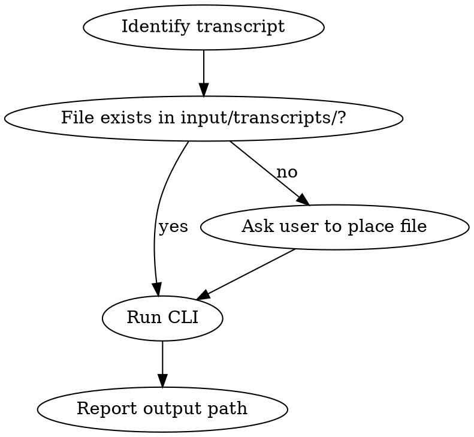

# Create Meeting Notes

Generate structured meeting notes from a plain-text transcript using Claude AI and the SE-DevTools CLI.

## Workflow



### Step 1 — Identify the transcript

- Ask for the filename if not provided (e.g., `standup.txt`, `sprint-review.txt`)
- Files must be in `input/transcripts/` at the repo root
- Use `--all` to process every `.txt` file in that directory at once

### Step 2 — Run the CLI

Run from `packages/docs-generator/`:

```bash
cd packages/docs-generator

# Single file:
python main.py meeting-notes --file "standup.txt"

# Batch — process every .txt in input/transcripts/:
python main.py meeting-notes --all
```

Output: `../../output/meeting_notes/meeting_notes_<filename_stem>.html`

### Step 3 — Report

- Show the output file path(s)
- Note how many files were processed (for `--all`)
- Flag any transcripts that failed or produced empty output

## Notes

- Transcripts are plain text; no special formatting required
- Claude AI reads the transcript and extracts: attendees, agenda items, decisions, action items
- Output is a branded HTML document ready to share
