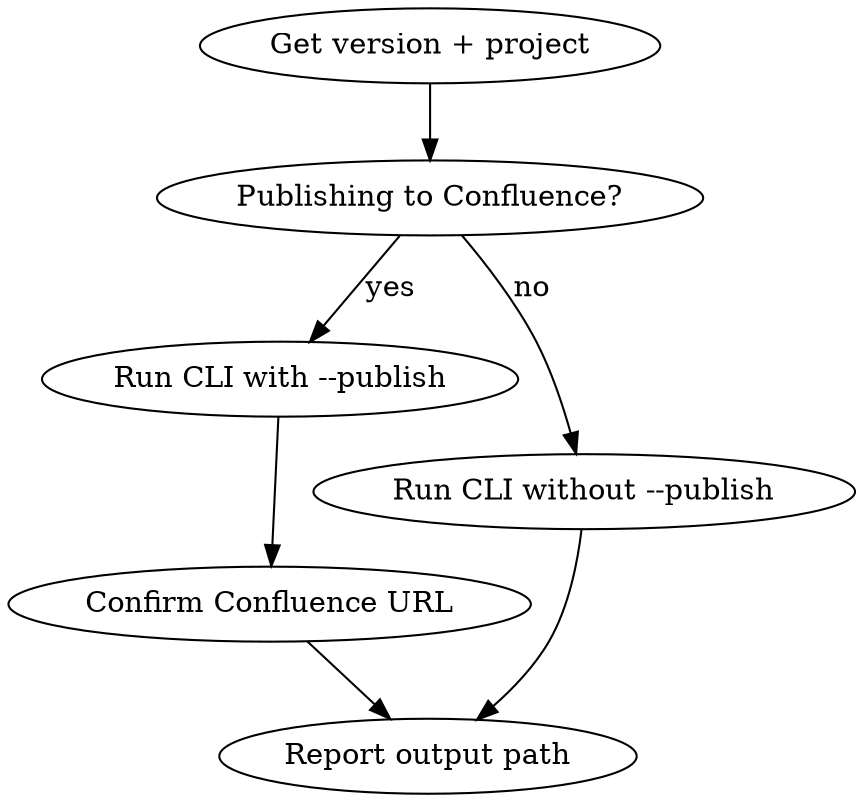

# Create Release Notes for Yammer

Generate release notes from a Jira version and optionally publish to Confluence (used for Yammer distribution).

## Workflow



### Step 1 — Gather inputs

Ask the user for:
- **Version string** (e.g., `2.4.1`) — required
- **Project key** (e.g., `PROJ`) — optional, uses config default if omitted
- **Publish to Confluence?** — adds `--publish` flag; pushes the HTML page to Confluence

### Step 2 — Run the CLI

Run from `packages/docs-generator/`:

```bash
cd packages/docs-generator

# Generate only:
python main.py release-notes --version "2.4.1"

# With project key:
python main.py release-notes --version "2.4.1" --project PROJ

# Generate + publish to Confluence:
python main.py release-notes --version "2.4.1" --project PROJ --publish
```

Output: `../../output/release_notes/release_notes_2.4.1.html`

### Step 3 — Report

- Confirm the output HTML file path
- If `--publish` was used: confirm the Confluence page URL
- Summarize: number of issues included, categories covered

## Notes

- Pulls fixed issues from the Jira version using `JiraClient`
- Issues are grouped by type (Bug, Story, Task) in the output
- `--publish` creates or updates a Confluence page — safe to re-run
- Output filename pattern is controlled by `config.yaml` under `output.release_notes_filename_pattern`
