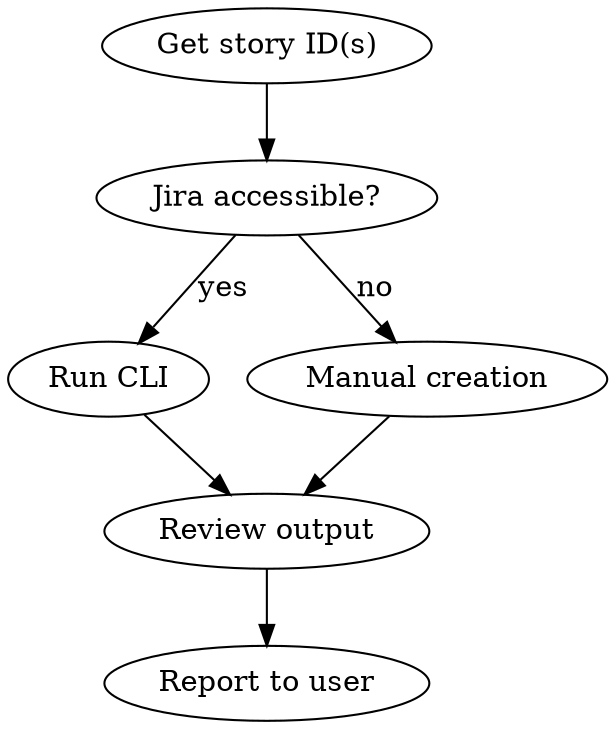

# Create Test Cases for User Story

Generate comprehensive test cases from a Jira user story using the SE-DevTools CLI and Claude AI.

## Workflow



### Step 1 — Identify the story

- Get the story ID(s) from the user (e.g., `PROJ-452`)
- If the project key isn't clear, ask for confirmation
- Multiple stories: pass each with `--story`

### Step 2a — Run the CLI (when Jira is accessible)

Run from `packages/docs-generator/`:

```bash
cd packages/docs-generator
python main.py test-cases --story PROJ-452
# Multiple stories:
python main.py test-cases --story PROJ-452 --story PROJ-453
```

Output file: `../../output/test_cases/test_cases_PROJ-XXX.html`

### Step 2b — Manual creation (fallback, no Jira access)

If the user provides story text / acceptance criteria directly:

1. Read the provided story content
2. Apply the manual-tester methodology:
   - Identify all acceptance criteria
   - Create test cases: happy path, negative, boundary, edge cases
   - Follow the TC-[Feature]-[Number] naming convention
3. Present test cases in the structured format (see manual-tester agent)

### Step 3 — Review & report

- Confirm the output file path
- Summarize: number of test cases generated, scenarios covered
- Flag any ambiguous acceptance criteria discovered

## Output Format

Generated HTML output: `output/test_cases/test_cases_PROJ-XXX.html`

For manual cases, present in markdown with the standard test case structure:
```
**Test Case ID**: TC-[Feature]-[Number]
**Title**: ...
**Priority**: Critical / High / Medium / Low
**Steps**: ...
**Expected Result**: ...
```
