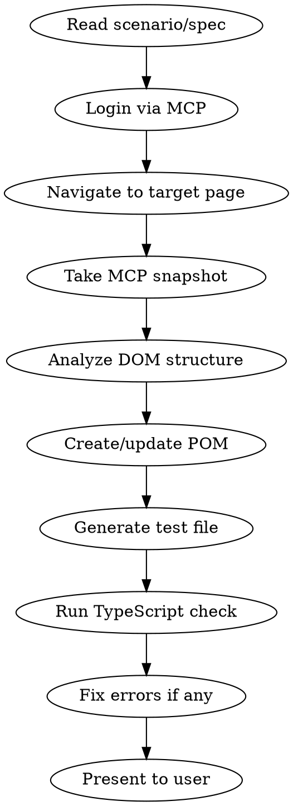

# Playwright Test Generator

## Overview

AI-powered test generation agent that reads human-readable test scenarios, explores the real application via Playwright MCP browser tools, captures actual DOM structure, and generates robust Playwright TypeScript test scripts with Page Object Models.

**Core principle:** Never guess locators — always explore the real DOM via MCP snapshots first, then generate tests using actual element structure.

## When to Use

- User provides test scenarios or specs (markdown, verbal, or structured)
- User asks to "generate tests", "create test cases", "automate this flow"
- User wants to explore a web page and create tests from it
- User asks to add tests for a new page/feature

**When NOT to use:**
- Fixing existing test failures (use systematic-debugging)
- Running tests (use terminal commands)
- Writing unit tests (this is for E2E/UI tests only)

## Workflow



### Phase 1: Explore via MCP

1. **Login to the application** using Playwright MCP:
   - Navigate to login URL via `browser_navigate`
   - Fill credentials via `browser_fill_form`
   - Click login via `browser_click`
   - Wait for redirect

2. **Navigate to target page** and take `browser_snapshot`

3. **For each tab/section**, click through and snapshot:
   - Record all element roles, names, and accessible labels
   - Note grid column headers verbatim
   - Identify filter elements (comboboxes, checkboxes, search boxes)
   - Capture pagination structure
   - Note any tab panels and their content

### Phase 2: Generate Code

4. **Create/update Page Object Model** in `src/pages/`
5. **Generate test file** in `tests/{feature}/`
6. **Update barrel exports** in `src/pages/index.ts`
7. **Run `npx tsc --noEmit`** to verify TypeScript compiles

## Project Conventions (MUST FOLLOW)

### Imports
```typescript
import { test, expect } from '../../src/fixtures';
import { PageName } from '../../src/pages';
import type { TypeName } from '../../src/pages';
import * as allure from 'allure-js-commons';
```

### Test Structure
```typescript
test.describe('Feature Area @tag', () => {
  test.setTimeout(90_000); // OutSystems apps are slow
  let loginPage: LoginPage;
  let targetPage: TargetPage;

  test.beforeEach(async ({ page, userCredentials }) => {
    loginPage = new LoginPage(page);
    targetPage = new TargetPage(page);

    await loginPage.goto();
    await loginPage.waitForPageLoad();
    await loginPage.login(userCredentials.login, userCredentials.password);
    await expect(page).toHaveURL(/.*GRC_PICASso/, { timeout: 30_000 });
    await expect(targetPage.pageTitle).toBeVisible({ timeout: 30_000 });
  });

  test('should [expected behavior] when [action/condition]', async ({ page }) => {
    await allure.suite('Feature Area');
    await allure.severity('critical'); // critical | normal | minor
    await allure.tag('smoke');         // smoke | regression
    await allure.description('Human-readable description');

    await test.step('Step description', async () => {
      // actions and assertions
    });
  });
});
```

### Page Object Model
```typescript
import { type Page, type Locator } from '@playwright/test';
import { BasePage } from './BasePage';

export class PageName extends BasePage {
  readonly url = '/path';

  // Group locators by section with comments
  readonly elementName: Locator;

  constructor(page: Page) {
    super(page);
    this.elementName = page.getByRole('button', { name: 'Submit' });
  }

  // Action methods
  async doSomething(): Promise<void> { ... }
}
```

## Critical Rules — OutSystems App Gotchas

These rules come from real failures. Violating them WILL cause test failures.

### NEVER use `networkidle`
OutSystems keeps WebSocket connections alive. `waitForLoadState('networkidle')` will ALWAYS timeout.
```typescript
// WRONG - will timeout every time
await page.waitForLoadState('networkidle');

// RIGHT - wait for specific element
await expect(element).toBeVisible({ timeout: 15_000 });
```

### NEVER use `selectOption()` on OutSystems dropdowns
OutSystems **never** uses native `<select>` elements — all dropdowns are custom OSUI widgets. `selectOption()` will fail silently or throw.
```typescript
// WRONG - selectOption() doesn't work with OutSystems dropdowns
await combobox.selectOption({ label: 'Germany' });

// RIGHT - click-to-open → click-to-select
await page.locator('.osui-dropdown').filter({ hasText: 'Select Country' }).click()
await page.getByText('Germany', { exact: true }).click()
```
See **OutSystems-Specific Patterns → Widget Interaction Patterns** for full dropdown examples.

### ALWAYS scope grid elements to active tabpanel
Multiple tabs = multiple hidden grids in DOM. Unscoped `getByRole('grid')` matches wrong one.
```typescript
// WRONG - may match hidden tab's grid
this.grid = page.getByRole('grid');

// RIGHT - scoped to active tabpanel
this.grid = page.getByRole('tabpanel').getByRole('grid');
```

### ALWAYS wait for grid data after tab switch
Tab content loads asynchronously. Column headers and rows appear AFTER the tab click.
```typescript
// In POM clickTab method:
async clickTab(tabName: TabType): Promise<void> {
  await tab.click();
  await this.grid.getByRole('columnheader').first().waitFor({ timeout: 15_000 });
}
```

### Handle strict mode violations
OutSystems often renders duplicate elements (hidden + visible). Use `.first()` or more specific locators.
```typescript
// WRONG - may match hidden duplicate
this.pageTitle = page.getByText('Page Title');

// RIGHT - take first visible match
this.pageTitle = page.locator('text=Page Title').first();
```

### NEVER hardcode row counts
Test data varies between environments. Don't assert exact row counts.
```typescript
// WRONG - fragile, data-dependent
expect(rowCount).toBeGreaterThan(10);

// RIGHT - verify data exists
await expect(grid.getByRole('row').nth(1)).toBeVisible({ timeout: 15_000 });
```

### Use column headers from real DOM, not assumptions
Always snapshot first, then use exact header text from the DOM.
```typescript
// Get headers from MCP snapshot, use EXACTLY as shown
expect(headers).toContain('STatus');  // Not 'Status' - match exact casing
```

## Locator Strategy

### Priority Order

1. `getByRole()` with accessible name — ALWAYS preferred
2. `getByLabel()` for form fields
3. `getByPlaceholder()` if no label
4. `getByText()` for visible text (assertions or unique identifiers)
5. `getByTestId()` last resort
6. Scoped `page.locator()` — ONLY when no semantic option, max 2 CSS combinators

**NEVER use:** XPath, long CSS selector chains (3+ combinators), auto-generated OutSystems IDs (`#b12-Input`), CSS class-based selectors (`.btn-primary`)

### Patterns by Element Type

**Buttons:**
```typescript
// BEST — role-based, covers <button>, <input type="submit">, role="button"
page.getByRole('button', { name: 'Submit Order' })
page.getByRole('button', { name: /submit/i })          // regex for dynamic/varying case

// GOOD — when button text is unique on page
page.getByText('Submit Order', { exact: true })

// OK — when multiple similar buttons exist
page.getByTestId('submit-order-btn')

// AVOID — brittle, breaks on any DOM change
page.locator('#app > div.container > form > button')
page.locator('button.btn.btn-primary')
```
- Use `{ exact: true }` when the page has buttons with similar names ("Save" vs "Save Draft")
- Never chain more than 2 levels of `.locator()` to reach a button

**Links:**
```typescript
// BEST
page.getByRole('link', { name: 'View Details' })

// ACCEPTABLE — only when links share identical text, scope to parent first
page.locator('table.orders').getByRole('link', { name: 'View' }).first()

// AVOID — href values are volatile, contain IDs/tokens/env-specific paths
page.locator('a[href="/products/123"]')
page.locator('a.link-primary')
```

**Dropdowns (OutSystems — NEVER use `selectOption()`):**
```typescript
// OutSystems always uses custom OSUI dropdown widgets, never native <select>

// BEST — click trigger, then click option by text
await page.locator('.osui-dropdown').filter({ hasText: 'Select Country' }).click()
await page.getByText('Germany', { exact: true }).click()

// GOOD — scope to parent block when multiple dropdowns exist
const form = page.locator('[data-block="AddressForm"]')
await form.locator('.osui-dropdown').first().click()
await page.getByText('Germany', { exact: true }).click()

// OK — when getByRole('option') works (some OSUI versions support it)
await page.getByLabel('Country').click()
await page.getByRole('option', { name: 'Germany' }).click()

// Search-select widgets (OutSystems lookup) — use pressSequentially, NOT fill()
await searchInput.pressSequentially('search query', { delay: 150 })

// NEVER — selectOption() does NOT work with OutSystems custom dropdowns
await dropdown.selectOption({ label: 'Germany' })  // ✗ WILL FAIL
```

**Input Fields:**
```typescript
// BEST — by associated label
page.getByLabel('Email Address')

// GOOD — by placeholder
page.getByPlaceholder('Enter your email')

// OK — by test id
page.getByTestId('email-input')

// AVOID — auto-generated IDs and internal name attributes
page.locator('input[name="txtEmail"]')
page.locator('#ContentPlaceHolder1_email')
```

**Tables and Grids:**
```typescript
// ALWAYS scope to active tabpanel (see OutSystems Gotchas above)
const grid = page.getByRole('tabpanel').getByRole('grid')

// Scope to a row, then find element within it
const row = grid.getByRole('row', { name: /Order #1024/ })
await row.getByRole('button', { name: 'Cancel' }).click()

// AVOID — positional indexing breaks when data changes
page.locator('table tbody tr:nth-child(3) td:nth-child(5) a')
```

**Checkboxes:**
```typescript
// BEST — by label
page.getByRole('checkbox', { name: 'Accept Terms' })

// OutSystems pattern — checkbox is sibling of label, scope via parent
page.getByText('Accept Terms').locator('..').getByRole('checkbox')
```

**Tabs:**
```typescript
page.getByRole('tab', { name: 'Details' })
```

### Locator DOs and DON'Ts

| DO | DON'T |
|----|-------|
| Use human-readable text users can see | Use auto-generated IDs (`#b12-Input`, `#ctl00_btn1`) |
| Scope to container before selecting (`tabpanel > grid`) | Use unscoped `getByRole('grid')` when multiples exist |
| Use `{ exact: true }` when text is ambiguous | Match partial text that hits multiple elements |
| Verify MCP snapshot text with `evaluate()` before using | Trust CSS-generated text (asterisks `*`) in snapshots |
| Use `.first()` for OutSystems duplicate elements | Let strict mode violations crash the test |
| Use `pressSequentially()` for search/autocomplete widgets | Use `.fill()` on OutSystems autocomplete inputs |
| Use regex `{ name: /Order #\d+/ }` for dynamic content | Hardcode IDs or dynamic values in locators |
| Add a comment when using `.nth()` or `.first()` | Use positional selectors without explaining why |

### Locator Decision Flowchart

```
Element has accessible role + name?
  → YES → getByRole(role, { name })
  → NO  → Element has a <label>?
            → YES → getByLabel(label)
            → NO  → Element has placeholder?
                      → YES → getByPlaceholder(text)
                      → NO  → Element has data-testid?
                                → YES → getByTestId(id)
                                → NO  → Scope to nearest named container,
                                         then use page.locator() with short CSS (max 2 combinators).
                                         Flag that a data-testid should be added.
```

## Verification Strategy

### Core Principle

> **Verify what the user sees or experiences, not what the system does internally.**
> A verification should answer: "How does the user know this action worked?"

### What TO Verify

| User Action | Verification | Example |
|---|---|---|
| Submit a form | Success message appears | `await expect(page.getByText('Product saved')).toBeVisible()` |
| Delete an item | Item disappears from list | `await expect(row).not.toBeVisible()` |
| Navigate to page | Key heading/content visible | `await expect(page.getByRole('heading', { name: 'Dashboard' })).toBeVisible()` |
| Select a dropdown | Dependent section updates | `await expect(orgLevel2Select).toBeEnabled()` |
| Open a dialog | Dialog heading visible | `await expect(page.getByRole('dialog')).toBeVisible()` |
| Close a dialog | Dialog gone | `await expect(page.getByRole('dialog')).not.toBeVisible()` |
| Fill and save a form | Saved values persist | `await expect(nameInput).toHaveValue('Expected Name')` |
| Toggle a checkbox | State reflected | `await expect(checkbox).toBeChecked()` |

### What NOT to Verify

| Anti-Pattern | Why It Fails | Do Instead |
|---|---|---|
| `toHaveURL(/.*ProductDetail\?ProductId=(?!0)\d+/)` | Complex regex tests routing internals, not UX | Verify key element visible on target page |
| `toHaveURL('https://staging.example.com/orders')` | Env-specific, breaks across environments | Loose check only: `toHaveURL(/\/orders/)` |
| `toHaveAttribute('data-status', 'confirmed')` | Internal attribute user never sees | Verify visible status text or indicator |
| `toHaveCSS('background-color', 'rgb(0,123,255)')` | Theme-dependent, styling detail | Verify visible state change instead |
| `page.waitForResponse('**/api/orders')` | Couples UI test to API contract | Verify the UI result of the API call |
| `expect(rowCount).toBe(42)` | Data changes between environments | `expect(firstRow).toBeVisible()` |
| `toContainText('long paragraph of text...')` | Fragile to any copy change | Check key phrase only |

### URL Verification Rules

URLs can be checked, but only for coarse navigation confirmation:

```typescript
// OK — loose section check
await expect(page).toHaveURL(/.*GRC_PICASso/)
await expect(page).toHaveURL(/\/dashboard/)

// OK — verify we left login
await expect(page).not.toHaveURL(/\/login/)

// BAD — complex regex validating query params, IDs, tokens
await expect(page).toHaveURL(/.*ProductDetail\?ProductId=(?!0)\d+/)
// Instead: verify the product heading or edit button is visible on the page
```

### Verification Complexity Rules

1. **One primary assertion per action outcome** — multiple related assertions in the same `test.step()` are fine
2. **Prefer `toBeVisible()` over `toBeAttached()`** — visibility is what matters to users
3. **Default assertion timeout (10s from config) is sufficient** — only increase for OutSystems-specific slow loads with explicit `{ timeout: 15_000 }`
4. **Never use `waitForTimeout()` before assertions** — assertions auto-retry. If something loads slowly, use `waitFor()` then assert:
```typescript
// CORRECT — explicit wait, then assert
await page.getByText('Processing complete').waitFor({ timeout: 30_000 })
await expect(page.getByText('Processing complete')).toBeVisible()

// AVOID — large timeout on assertion hides real issues
await expect(page.getByText('Processing complete')).toBeVisible({ timeout: 60_000 })
```

### Verification Decision Flowchart

```
After an action, what changed for the user?
  → New element appeared       → toBeVisible()
  → Element disappeared        → not.toBeVisible()
  → Text changed               → toHaveText() or toContainText()
  → Input value set            → toHaveValue()
  → Navigated to new page      → toBeVisible() on key heading/content
  → Element enabled/disabled   → toBeEnabled() / toBeDisabled()
  → Checkbox toggled           → toBeChecked() / not.toBeChecked()
  → Nothing visible changed    → Reconsider: is this worth a UI assertion?
```

## Waiting & Timeout Strategy

### Core Rule

> **Never add a timeout to an individual action or assertion.**
> Identify a UI readiness signal and `waitFor()` on that signal before acting.
> If you're writing `{ timeout: 60_000 }` on a `.click()` or `expect()`,
> stop — you are treating the symptom, not the cause.

### Readiness Signals

| Signal | When to Use |
|---|---|
| Page heading appears | After navigation — heading means the page is rendered |
| OutSystems loading overlay disappears | After screen navigation / data fetch (`.feedback-message-loading`) |
| Content placeholder resolves | Sections loading async data (`.content-placeholder.loading`) |
| Table/list populates | Pages that load data asynchronously after mount |
| Element becomes enabled | Forms that disable inputs until data loads |
| ~~`networkidle`~~ | **BANNED** — OutSystems WebSocket keeps it alive forever (see OutSystems Gotchas) |

### Waiting Patterns

**Pattern 1 — Wait for content to appear (most common):**
```typescript
await page.getByRole('link', { name: 'Products' }).click()
await page.getByRole('heading', { name: 'Product List' }).waitFor({ timeout: 30_000 })
// Page is ready — use default timeouts for all subsequent actions
await page.getByRole('link', { name: 'Widget Pro' }).click()
```

**Pattern 2 — Wait for OutSystems loading overlay to disappear:**
```typescript
await page.getByRole('button', { name: 'Search' }).click()
await waitForOSScreenLoad(page)  // see src/helpers/wait.helper.ts
// Results are now rendered
await expect(page.getByRole('row')).not.toHaveCount(0)
```

**Pattern 3 — Wait for element to become enabled:**
```typescript
// OutSystems forms disable inputs until data loads
await page.getByLabel('Email').fill('user@example.com')
await expect(page.getByRole('button', { name: 'Submit' })).toBeEnabled()
await page.getByRole('button', { name: 'Submit' }).click()
```

### What NOT to Do

```typescript
// ✗ NEVER — hard sleep wastes time and is still flaky
await page.waitForTimeout(5000)

// ✗ NEVER — inline timeout on a click
await page.getByRole('button', { name: 'Submit' }).click({ timeout: 60_000 })

// ✗ NEVER — large timeout on assertion hides real issues
await expect(page.getByText('Success')).toBeVisible({ timeout: 60_000 })

// ✗ NEVER — OutSystems WebSocket keeps network alive forever
await page.waitForLoadState('networkidle')

// ✗ AVOID — waitForLoadState('load') doesn't cover client-side rendering
await page.waitForLoadState('load')
```

### Timeout Configuration

Defaults are set in `playwright.config.ts` — individual tests should NOT override them:
- `timeout: 30_000` (test), `expect.timeout: 10_000`, `actionTimeout: 15_000`, `navigationTimeout: 30_000`
- Only add explicit timeout on `waitFor()` for known slow operations, with a comment explaining why

### Timeout Troubleshooting Flowchart

```
Test timing out on a locator or action?
  → Page still loading?
      → YES → Add waitFor() on readiness signal BEFORE the action
  → Element behind overlay/modal?
      → YES → waitFor({ state: 'hidden' }) on blocking element
  → Element not in DOM?
      → YES → Locator is wrong — fix the selector
  → Element exists, nothing blocks?
      → Increase actionTimeout in playwright.config.ts (not inline)
        Add a comment in config explaining which part of the app needs it
```

### Reusable Wait Helpers

Use helpers from `src/helpers/wait.helper.ts` instead of inline waits:

```typescript
import { waitForPageReady, waitForOSScreenLoad, waitForTableData, navigateAndWait } from '../../src/helpers/wait.helper';

// After navigation — wait for heading
await navigateAndWait(page, 'Orders', 'Order History')

// After data fetch — wait for table rows
await waitForTableData(page)

// After any action — wait for OutSystems loading overlay
await waitForOSScreenLoad(page)
```

## Allure Metadata (Required)

Every test MUST have:
```typescript
await allure.suite('Feature Area');
await allure.severity('critical' | 'normal' | 'minor');
await allure.tag('smoke' | 'regression');
await allure.description('What this test verifies');
```

## File Naming & Location

| Type | Path | Convention |
|------|------|-----------|
| Test file | `tests/{feature}/{name}.spec.ts` | kebab-case |
| Page Object | `src/pages/{Name}Page.ts` | PascalCase |
| Barrel export | `src/pages/index.ts` | Always update |
| Spec input | `specs/{feature}/{name}.md` | kebab-case |

## OutSystems-Specific Patterns

> OutSystems Reactive Web Apps generate custom DOM with auto-generated IDs and OSUI widgets.
> These rules override or extend the general patterns above.

### OutSystems ID Patterns — NEVER Use

```typescript
// Block-positional IDs — shift when blocks are added/removed/reordered
page.locator('#b3-Button')       // ✗
page.locator('#b1-Input')        // ✗
page.locator('#b12-b7-Column1')  // ✗

// Widget-name IDs — look stable but regenerate on screen republish
page.locator('#Input_Username')      // ✗
page.locator('#Dropdown_Country')    // ✗
page.locator('#b4-TableRecords')     // ✗
```

**How to recognize:** starts with `b` + number (`b1-`, `b12-`), or widget type prefix (`Input_`, `Dropdown_`, `Button_`, `Link_`). **Never use these.**

### Stable Locator Strategies for OutSystems

1. **Text-based (most reliable):** `getByRole()`, `getByText()`, `getByPlaceholder()`, `getByLabel()`
2. **Scope to `[data-block]`:** OutSystems Blocks have stable `data-block` attributes
   ```typescript
   const loginBlock = page.locator('[data-block="LoginForm"]')
   await loginBlock.getByPlaceholder('Username').fill('testuser')
   await loginBlock.getByRole('button', { name: 'Sign In' }).click()
   ```
3. **`data-testid` via Extended Properties:** Request from dev team when needed
   ```typescript
   page.getByTestId('submit-order-btn')  // added via OutSystems Extended Properties
   ```

### Widget Interaction Patterns

**Dropdown (OSUI — NEVER use `selectOption()`):**
```typescript
// OutSystems NEVER uses native <select> — always custom OSUI widgets
await page.locator('.osui-dropdown').filter({ hasText: 'Select Country' }).click()
await page.locator('.osui-dropdown__list').waitFor()
await page.getByText('Germany', { exact: true }).click()

// Scope to parent block when multiple dropdowns exist
const addressBlock = page.locator('[data-block="AddressForm"]')
await addressBlock.locator('.osui-dropdown').first().click()
await page.getByText('Germany', { exact: true }).click()
```

**Searchable Dropdown / Autocomplete:**
```typescript
await page.locator('.osui-dropdown').filter({ hasText: 'Select Product' }).click()
await page.locator('.osui-dropdown__search-input').fill('Widget')
await page.getByText('Widget Pro 2000', { exact: true }).click()
```

**Date Picker:**
```typescript
// Most reliable: type date directly + Tab to trigger onChange
const dateInput = page.getByLabel('Start Date')
await dateInput.clear()
await dateInput.fill('2025-03-15')
await dateInput.press('Tab')  // triggers OutSystems client-side onChange
```

**Toggle / Switch:**
```typescript
// Click the label text — don't interact with hidden checkbox
await page.getByText('Enable notifications').click()
// Or scope to toggle container
await page.locator('.osui-toggle').filter({ hasText: 'Enable notifications' }).click()
```

**Popup / Modal:**
```typescript
// OutSystems popups don't always have role="dialog" — use OSUI class
await page.getByRole('button', { name: 'Add Item' }).click()
await page.locator('.osui-popup').waitFor()
await page.locator('.osui-popup').getByRole('button', { name: 'Save' }).click()
await page.locator('.osui-popup').waitFor({ state: 'hidden' })
```

**Tabs:**
```typescript
await page.getByRole('tab', { name: 'Shipping' }).click()
await page.locator('.osui-tabs__content--is-active').waitFor()
await page.locator('.osui-tabs__content--is-active').getByLabel('Address').fill('123 Main St')
```

**Table Records vs List Records:**
```typescript
// Table Records — standard <table>, use role-based locators
const table = page.getByRole('table')
await table.getByRole('row', { name: /ORD-1024/ }).getByRole('link', { name: 'Details' }).click()

// List Records — renders as <div> list, scope to [data-block]
const list = page.locator('[data-block="OrdersList"]')
await list.getByText('ORD-1024').click()
```

### OutSystems Loading Indicators

| Indicator | CSS Selector | Meaning |
|---|---|---|
| Screen loading overlay | `.feedback-message-loading` | Screen Aggregate is running |
| Content placeholder | `.content-placeholder.loading` | Section still loading data |
| Skeleton / shimmer | `.osui-skeleton` | Placeholder for pending data |
| Disabled buttons during submit | `button[disabled]` | Server action processing |
| Feedback message | `.feedback-message-success`, `.feedback-message-error` | Server action completed |

**Standard wait sequence for OutSystems navigation:**
```typescript
await page.getByRole('link', { name: 'Products' }).click()
await waitForOSScreenLoad(page)  // handles overlay + placeholders
await page.getByRole('heading', { name: 'Product Catalog' }).waitFor()
// Now interact normally with default timeouts
```

### OutSystems Verification Patterns

```typescript
// After navigation — verify screen heading
await expect(page.getByRole('heading', { name: 'Order Details' })).toBeVisible()

// After form submit — verify feedback message
await expect(page.locator('.feedback-message-success')).toBeVisible()
await expect(page.getByText(/saved successfully/i)).toBeVisible()

// After delete — verify item gone or feedback
await expect(page.getByRole('row', { name: /ORD-1024/ })).not.toBeVisible()

// NEVER verify URL — OutSystems Reactive uses client-side routing with hashes/screen IDs
// await expect(page).toHaveURL(/.*OrderDetail.*/)  // ✗ DON'T DO THIS
```

### Requesting Testability Improvements from Dev Team

| Problem | Request |
|---|---|
| Icon-only button with no text | Add `aria-label` via Extended Properties |
| Multiple identical links in a list | Add `data-testid` with dynamic value on each List Record item |
| Label not associated with input | Use OutSystems Label widget `InputWidget` parameter |
| Dropdown has no distinguishing context | Add `aria-label` via Extended Properties |
| No stable parent container to scope to | Wrap section in named Block or Container with `data-testid` |

### OutSystems Locator Decision Flowchart

```
Trying to locate an element in an OutSystems app:

Does it have visible text (button label, link text, heading)?
  → YES → getByRole() with name, or getByText({ exact: true })
  → NO  → Has a placeholder?
            → YES → getByPlaceholder()
            → NO  → Has a label association?
                      → YES → getByLabel()
                      → NO  → Has data-testid (Extended Properties)?
                                → YES → getByTestId()
                                → NO  → Can scope to parent [data-block]?
                                          → YES → scope to block, then text/role within
                                          → NO  → Use OSUI class (.osui-dropdown, .osui-toggle)
                                                   as last resort, scoped to parent container.
                                                   Flag for data-testid request to dev team.
```

## Quick Checklist

Before presenting generated tests to user:

- [ ] Explored all target pages/tabs via MCP snapshots
- [ ] Used exact locator text from DOM (not guessed)
- [ ] Scoped grid elements to `tabpanel`
- [ ] No `networkidle` waits anywhere
- [ ] No hardcoded row counts or dropdown values
- [ ] Added `test.setTimeout(90_000)` for OutSystems
- [ ] All Allure metadata present
- [ ] TypeScript compiles clean (`npx tsc --noEmit`)
- [ ] Updated barrel exports in `index.ts`
- [ ] Used `.first()` for potentially ambiguous locators
- [ ] Locators use human-readable text, not auto-generated IDs
- [ ] Verified MCP snapshot text matches actual DOM (no CSS-generated characters like `*`)
- [ ] Assertions verify user-visible outcomes, not internals
- [ ] No complex URL regex assertions — use element visibility instead
- [ ] No `toHaveCSS()`, `toHaveAttribute()` for styling or internal state
- [ ] One primary assertion per action outcome
- [ ] No inline `{ timeout: ... }` on actions or assertions — use `waitFor()` then assert
- [ ] Timeouts only on `waitFor()` for known slow operations, with explanatory comment
- [ ] No `page.waitForTimeout()` anywhere
- [ ] No `selectOption()` — OutSystems uses custom dropdowns only (click → click)
- [ ] OutSystems widget interactions use OSUI class patterns (see OutSystems-Specific Patterns)
- [ ] Uses `waitForOSScreenLoad()` after navigation / data-triggering actions

## Common Mistakes

| Mistake | Fix |
|---------|-----|
| `waitForLoadState('networkidle')` | Wait for specific element visibility |
| `dropdown.selectOption({ label: 'X' })` | Click trigger → click option text (OutSystems custom dropdowns) |
| `getByRole('grid')` unscoped | `getByRole('tabpanel').getByRole('grid')` |
| Asserting `rowCount > 10` | Assert `row.nth(1).toBeVisible()` |
| `getByText('exact text')` strict violation | Add `.first()` or use `locator('text=...')` |
| Checking grid immediately after tab click | Wait for `columnheader` first |
| Guessing column header names | Snapshot first, copy exact text |
| Using `page.waitForTimeout()` | Use auto-retrying assertions with timeout |
| `toHaveURL(/.*ProductDetail\?ProductId=(?!0)\d+/)` | Verify element visibility on target page instead |
| `getByText('Product Owner*')` with CSS asterisk | `getByText('Product Owner', { exact: true })` — asterisk is CSS-generated |
| `locator('#b12-b34-Input')` auto-generated ID | `getByRole('textbox', { name: 'Product Name*' })` |
| `.fill()` on search/autocomplete widget | `.pressSequentially(query, { delay: 150 })` |
| `expect(rows).toHaveCount(42)` exact count | `expect(row.nth(1)).toBeVisible()` — data varies |
| `toHaveAttribute('data-status', 'confirmed')` | Verify visible status text or indicator |
| `toHaveCSS('background-color', ...)` | Verify visible state change instead |
| `expect(text).toBeVisible({ timeout: 60_000 })` | `waitFor({ timeout: 30_000 })` then `expect().toBeVisible()` |
| `button.click({ timeout: 60_000 })` | `waitFor()` on readiness signal, then `click()` default timeout |
| `page.locator('#Input_Username')` | `getByPlaceholder()` or scope to `[data-block]` |
| `page.locator('#b3-Button')` OutSystems block ID | `getByRole('button', { name: '...' })` |
| Missing `waitForOSScreenLoad()` after navigation | Add `waitForOSScreenLoad(page)` before interacting with loaded content |
