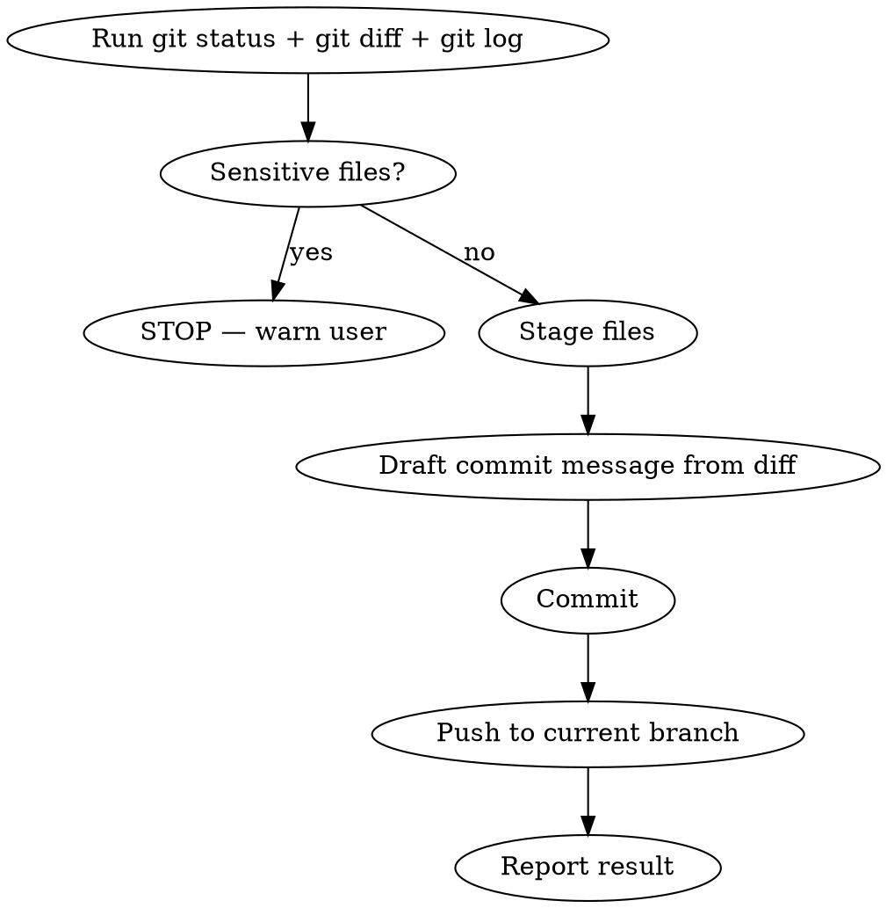

# Push

Stage all changes, commit with a meaningful message, and push to the remote.

## Workflow



### Step 1 — Assess changes

Run in parallel:
- `git status` (never use `-uall`)
- `git diff` and `git diff --cached` to see all changes
- `git log --oneline -5` to match the repo's commit message style

### Step 2 — Safety check

**STOP and warn the user** if any staged/untracked files look sensitive:
- `.env`, `.env.*` (except `.env.example`)
- credentials, secrets, tokens, API keys
- `storage/`, `auth.json`, private keys

### Step 3 — Stage files

- Prefer `git add <specific files>` over `git add -A`
- Group related files logically

### Step 4 — Commit

Draft a concise commit message (1-2 sentences) that:
- Summarizes the **why**, not just the **what**
- Matches the style from `git log`
- Uses conventional prefix if the repo does (fix:, feat:, chore:, etc.)

Always end with:
```
Co-Authored-By: Claude Opus 4.6 <noreply@anthropic.com>
```

Use a HEREDOC to pass the message:
```bash
git commit -m "$(cat <<'EOF'
Message here

Co-Authored-By: Claude Opus 4.6 <noreply@anthropic.com>
EOF
)"
```

### Step 5 — Push

- Push to the current branch's upstream: `git push`
- If no upstream is set: `git push -u origin <branch>`
- **Never force-push** unless the user explicitly asked

### Step 6 — Report

Show the user:
- Commit hash and message
- Branch pushed to
- Number of files changed
